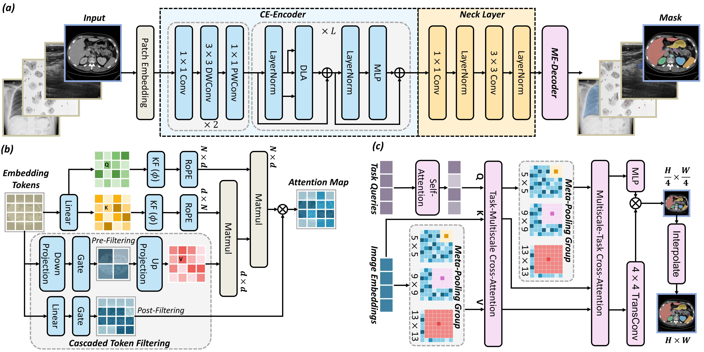

# *HRMedSeg*: Unlocking High-resolution Medical Image segmentation via Memory-efficient Attention Modeling

<p align="center">
  
</p>

<!-- <i>The icon is generated by recraft.ai.</i> -->


### [ArXiv Paper](https://arxiv.org/abs/2403.11050) 

[Qing Xu](https://scholar.google.com/citations?user=IzA-Ij8AAAAJ&hl=en&authuser=1)<sup>1*</sup> [Zhenye Lou]()<sup>2*</sup> [Chenxin Li](https://xggnet.github.io/)<sup>3*</sup> [Xiangjian He](https://scholar.google.com/citations?user=BiBXGfIAAAAJ&hl=en&authuser=1)<sup>1✉</sup> [Rong Qu](https://scholar.google.com/citations?user=ErszCRMAAAAJ&hl=en&authuser=1)<sup>4</sup> [Tesema Fiseha Berhanu](https://scholar.google.com/citations?hl=en&authuser=1&user=XoL3ZMAAAAAJ)<sup>1</sup> [Yi Wang](https://scholar.google.com/citations?hl=en&user=C1BnRlMAAAAJ&view_op=list_works&sortby=pubdate)<sup>5</sup> [Wenting Duan](https://scholar.google.com/citations?user=H9C0tX0AAAAJ&hl=en&authuser=1)<sup>6</sup> [Zhen Chen](https://franciszchen.github.io/)<sup>7</sup>

<sup>1</sup>UNNC &emsp; <sup>2</sup>Sichuan University &emsp; <sup>3</sup>CUHK &emsp; <sup>4</sup>University of Nottingham &emsp; <sup>5</sup>Dalian University of Technology &emsp; <sup>6</sup>Univeristy of Lincoln &emsp; <sup>7</sup>HKISI, CAS &emsp;

<sup>\*</sup> Equal Contributions. <sup>✉</sup> Corresponding Author. 

-------------------------------------------


## 📰News

- **[2025.04.05]** The pre-print paper is now available! Fine-tuning the model with 1024×1024 image resolution and 16 batch sizes only needs **9.4GB** GPU memory (~1 GTX1080ti or 1 RTX3060), 4 batch sizes only needs **2.6GB** GPU memory (~1 GTX1060 3G). We hope everyone can enjoy our model.
- **[2025.04.05]** The checkpoint pre-trained on 0.1% SA-1B dataset is now available!  

## 🛠Setup

```bash
git clone https://github.com/xq141839/ESP-MedSAM.git
cd HRMedSeg
conda create -f HRMedSeg.yaml
```

**Key requirements**: Cuda 11.8+, PyTorch 2.0+

## 📚Data Preparation
- **Distillation Pretraining (Optional)**:  [https://ai.meta.com/datasets/segment-anything-downloads/](https://ai.meta.com/datasets/segment-anything-downloads) ID: sa_000000.tar
- **Dermoscopy**: [https://challenge.isic-archive.com/data/#2018](https://challenge.isic-archive.com/data/#2018)
- **X-ray**: [https://www.kaggle.com/code/nikhilpandey360/lung-segmentation-from-chest-x-ray-dataset/input](https://www.kaggle.com/code/nikhilpandey360/lung-segmentation-from-chest-x-ray-dataset/input)
- **Fundus**: [https://refuge.grand-challenge.org/](https://refuge.grand-challenge.org/)
- **Ultrasound**: [https://www.kaggle.com/datasets/jarintasnim090/udiat-data](https://www.kaggle.com/datasets/jarintasnim090/udiat-data)
- **Microscopy**: [https://www.kaggle.com/competitions/data-science-bowl-2018](https://www.kaggle.com/competitions/data-science-bowl-2018)
- **CT**: [https://github.com/Beckschen/TransUNet/blob/main/datasets/README.md](https://github.com/Beckschen/TransUNet/blob/main/datasets/README.md)
- **Colonoscopy**: [https://figshare.com/articles/figure/Polyp_DataSet_zip/21221579?file=37636550](https://figshare.com/articles/figure/Polyp_DataSet_zip/21221579?file=37636550)

The data structure is as follows.
```
HRMedSeg
├── datasets
│   ├── image_1024
│     ├── ISIC_0000000.png
|     ├── ...
|   ├── mask_1024
│     ├── ISIC_0000000.png
|     ├── ...
|   ├── isic_data_split.json
|   ├── ...
```

## 🎪Segmentation Model Zoo
We provide all pre-trained models here.
| Teacher Model | Pretraining Data | Checkpoints |
|-----|------|-----|
|SAM| 0.1% SA-1B | [Link](https://nottinghamedu1-my.sharepoint.com/:f:/r/personal/scxqx1_nottingham_edu_cn/Documents/ESP-MedSAM?csf=1&web=1&e=GDtIv3)|
|SAM2| 0.1% SA-1B | [Link](https://nottinghamedu1-my.sharepoint.com/:f:/r/personal/scxqx1_nottingham_edu_cn/Documents/ESP-MedSAM?csf=1&web=1&e=GDtIv3)|
|SAM| 1% SA-1B |TBA|
|SAM2| 1% SA-1B |TBA|

## 📜Citation
If you find this work helpful for your project,please consider citing the following paper:
```

```
